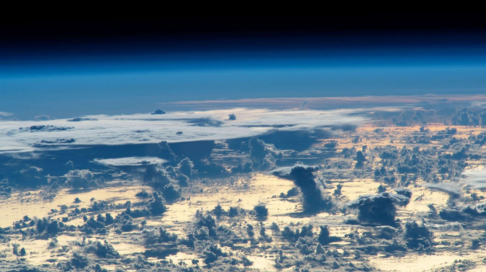

# 世界參考圖

- 作品：Cloudscape at Dawn, Northwest Atlantic。
- 作者／機構：NASA/JSC；ISS Crew Earth Observations Facility 與 Earth Science and Remote Sensing Unit。
- 攝影編號：ISS066-E-37532；ISS 外置相機，2021-11-04。
- [官方來源頁](https://science.nasa.gov/earth/earth-observatory/cloudscape-at-dawn-northwest-atlantic-149490/)，2026-09-24 已開啟並確認圖片與署名。
- [官方圖片](https://assets.science.nasa.gov/dynamicimage/assets/science/esd/eo/images/imagerecords/149000/149490/iss066e037532_lrg.jpg?crop=faces%2Cfocalpoint&fit=clip&h=2768&w=4928)。
- 原始機構發布版本已調整對比與移除鏡頭瑕疵；本 repo 保存下載版本，簡報使用版面裁切，未添加虛構物體。
- 用途：雲層的明暗、尺度與漂移感參考。照片地點是北大西洋，**不是多姆山，不是人類消失後的影像**。
- NASA 原頁說明此照片公開提供；本作業保留原機構署名，不宣稱 NASA 認可作品設定。

本次未使用 AI 生成概念圖。透明薄膜、結晶與大型漂浮花園仍是文字中的創作設定，不能用這張雲景證明。
